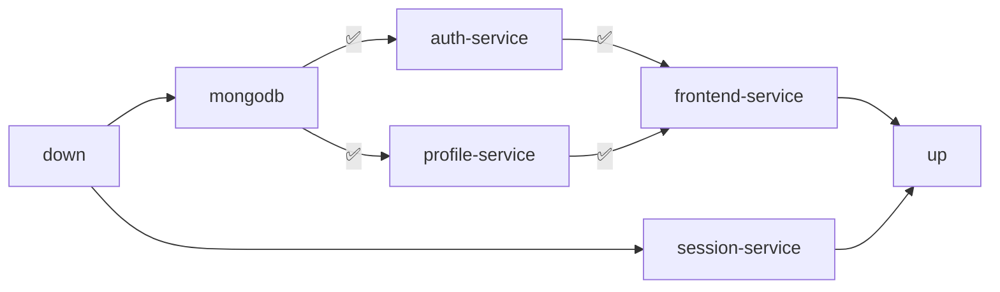

# Deployment

It is possible to deploy *Let's Stream It* by either running locally the single services one by one or more easily through [Docker Compose](https://docs.docker.com/compose/).

- To run each single microservice locally follow the instruction given inside each repository `README` ([Session Service](https://github.com/LetsStreamIt/session-service), [Profile Service](https://github.com/LetsStreamIt/profile-service), [Auth Service](https://github.com/LetsStreamIt/auth-service) and [Frontend Service](https://github.com/LetsStreamIt/frontend-service)). Also make sure to run the [MongoDB container](https://hub.docker.com/_/mongo) on port 27017;
- To deploy all services at once navigate to the [Bootstrap repository](https://github.com/LetsStreamIt/bootstrap) and follow the provided indications.

In both the cases, the microservices have the following dependencies. In the `docker-compose` file they are guaranteed to be deployed in this sequence by leveraging [healthchecks](https://docs.docker.com/reference/compose-file/services/#healthcheck) and [`depends_on`](https://docs.docker.com/reference/compose-file/services/#depends_on) attributes.



<Summary title="Docker Compose file">

```gherkin
x-common-variables: &common-variables
  PROFILE_SERVICE_HOSTNAME: profile-service
  PROFILE_SERVICE_PORT: 3001
  AUTH_SERVICE_HOSTNAME: auth-service
  AUTH_SERVICE_PORT: 3000
  SESSION_SERVICE_HOSTNAME: session-service
  SESSION_SERVICE_PORT: 4000
  MONGO_HOSTNAME: mongodb-service
  MONGO_PORT: 27017

services:
  mongodb-service:
    image: mongo:latest
    container_name: mongodb-service
    hostname: mongodb-service
    restart: always
    volumes:
      - ./data/db:/data/db
    healthcheck:
      test: echo 'db.runCommand("ping").ok' | mongosh localhost:27017/test --quiet

  session-service:
    image: ghcr.io/letsstreamit/session-service:main
    container_name: session-service
    hostname: session-service
    restart: always
    environment:
      <<: *common-variables

  frontend-service:
    image: ghcr.io/letsstreamit/frontend-service:main
    container_name: frontend-service
    hostname: frontend-service
    restart: always
    ports:
      - "80:80"
    depends_on:
      auth-service:
        condition: service_healthy
      profile-service:
        condition: service_healthy
    environment:
      VITE_YOUTUBE_API_KEY: ${YOUTUBE_API_KEY} # Set this in your .env file
      <<: *common-variables

  auth-service:
    image: ghcr.io/letsstreamit/auth-service:main
    depends_on:
      mongodb-service:
        condition: service_healthy
    container_name: auth-service
    hostname: auth-service
    restart: always
    environment:
      JWT_SECRET: ${JWT_SECRET} # Set this in your .env file
      <<: *common-variables
    healthcheck:
      test: ["CMD", "curl", "-f", "http://localhost:3000/healthcheck"]

  profile-service:
    image: ghcr.io/letsstreamit/profile-service:latest
    depends_on:
      mongodb-service:
        condition: service_healthy
    container_name: profile-service
    hostname: profile-service
    restart: always
    environment:
      AKKA_LICENSE_KEY: ${AKKA_LICENSE_KEY} # Set this in your .env file
      <<: *common-variables
    healthcheck:
      test: ["CMD", "curl", "-f", "http://profile-service:3001/health"]
```

</Summary>