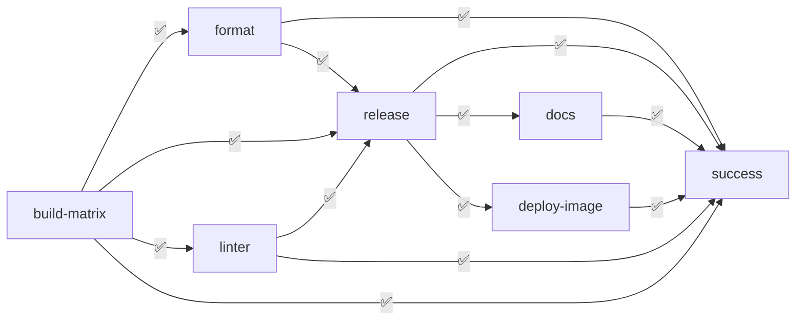

# DevOps

## Version Control

### DVCS

In each microservice, the adopted development process follows [Trunk-based development](https://www.atlassian.com/continuous-delivery/continuous-integration/trunk-based-development):
- Each repository uses the `main` branch as the stable branch, containing working code;
- A small increment in the project such as features/fixes/chores are pushed in a separate, dedicated branch, and then merged into the main branch via Pull Requests (PR), whenever ready. The PRs are configured to not require code reviews from other team members to be merged, but the CI/CD pipeline to succeed. This ensures that the stable branch is clean from errors.

### Conventional Commits

[Conventional Commits](https://www.conventionalcommits.org/en/v1.0.0/) is used as a standard way for commenting commits.

### Semantic Release

To automate the release process, [Semantic Release](https://semantic-release.gitbook.io/semantic-release) has been integrated into the CI/CD pipeline. The plugin automatically inspects commit messages, produces a release version accordingly, and publishes it into the GitHub Releases. A `CHANGELOG` is generated as well to comment on the new increments of the release.

## Continuous Integration and Delivery

In all the microservices repositories a Continuous Integration and Delivery pipeline is built, so that whenever a feature/fix/major update is made, a new release is triggered. The pipeline also ensures the project tests always pass and that it follows strict code quality metrics.

The same CI/CD pipeline is adopted by all the microservices and is composed of the following jobs:
- `build`: is responsible for checking if the project successfully builds. A matrix of OS is provided: Ubuntu, MacOS, Windows;
- `format`: is responsible for checking if the code is properly formatted;
- `linter`: analyses the source code searching for errors and vulnerabilities;
- `release`: semantic-release is run to check if a new release should be triggered, based on the commit messages. This job is run only whenever a push into the main branch is made.
- `deploy-image`: builds and deploys a Docker image in Github Packages, based on the `Dockerfile` placed in the root directory of the microservice. Depends on the `release` job and it's run only whenever a new release is published.
- `docs`: builds the code documentation of the project and publishes it into the Github Pages of the microservice repository. As `deploy-image`, it depends on the `release` job and it's triggered whenever a new release is published.
- `success`: checks if the pipeline succeded.

## Other Git(Hub) features

### Git Hooks

Each repository has two Git Hooks. If at least one of these fails, a Git commit is not produced:
- `pre-commit` hook is added to minimize commits that break tests, code format, or lint checks. Even if these checks are made before merging into the `main` branch, at this stage they avoid the proliferation of code format or test fixes commits;
- `commit-msg` ensures that the commit message follows the Conventional Commit specification.

### Github Templates

Three Github Templates repositories have been created to set the project structure of the microservices:
- [VueJs Template](https://github.com/LetsStreamIt/Template-for-VueJs-Projects) is a template for kickstarting a VueJs project. It is used by the `frontend-service`;
- [Typescript Template](https://github.com/LetsStreamIt/Template-for-Typescript-Projects) for kickstarting a Typescript project. Used by `session-service` and `auth-service`;
- [Scala3 Template](https://github.com/LetsStreamIt/Template-for-Scala3-Projects) for kickstarting a Scala3 project. Used by `profile-service`.

